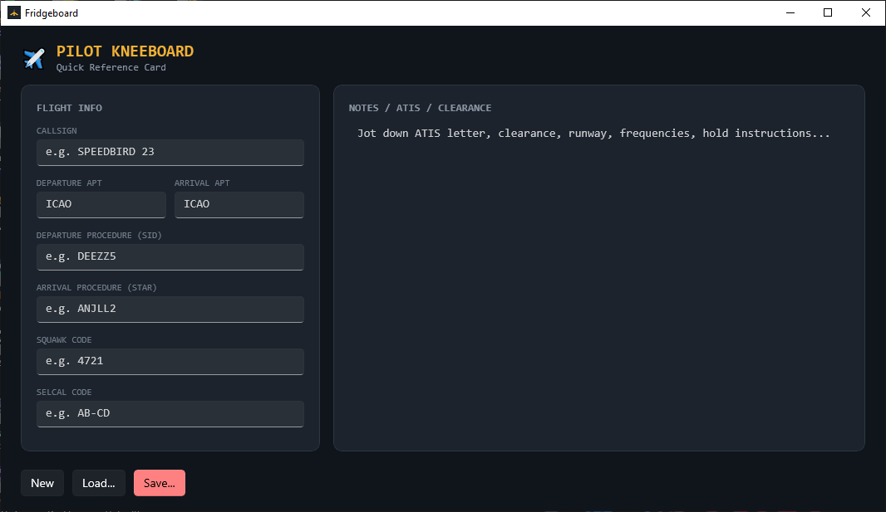

# Fridgeboard (Pilot Kneeboard)

A simple digital kneeboard for flight simmers. One card holds:

- **Callsign**
- **Departure / Arrival airport (ICAO)**
- **SID** — departure procedure
- **STAR** — arrival procedure
- **Squawk code** — validated as 4 octal digits (0–7)
- **SELCAL code** — validated as 4 letters (e.g. `AB-CD`)
- A free-form **notes** pad for ATIS, clearance, runway, frequencies, etc.

Cards can be saved to and loaded from a `.json` file, so you can prep a card
before you fly and reload it mid-session if the app restarts.

## Requirements

- Windows 10 (build 17763+) or Windows 11
- x64 or ARM64 processor (matching your download)
- **Windows App SDK 1.5 Runtime** — required, not bundled
  → Download: https://learn.microsoft.com/en-us/windows/apps/windows-app-sdk/downloads-archive
  (grab the 1.5 installer for your architecture)

## Screenshot

## Credit(s)

This code is mostly written using Claude AI. 
